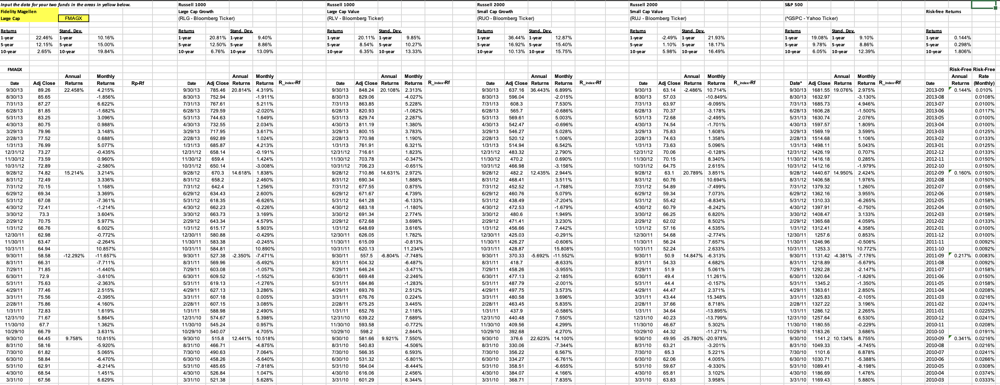
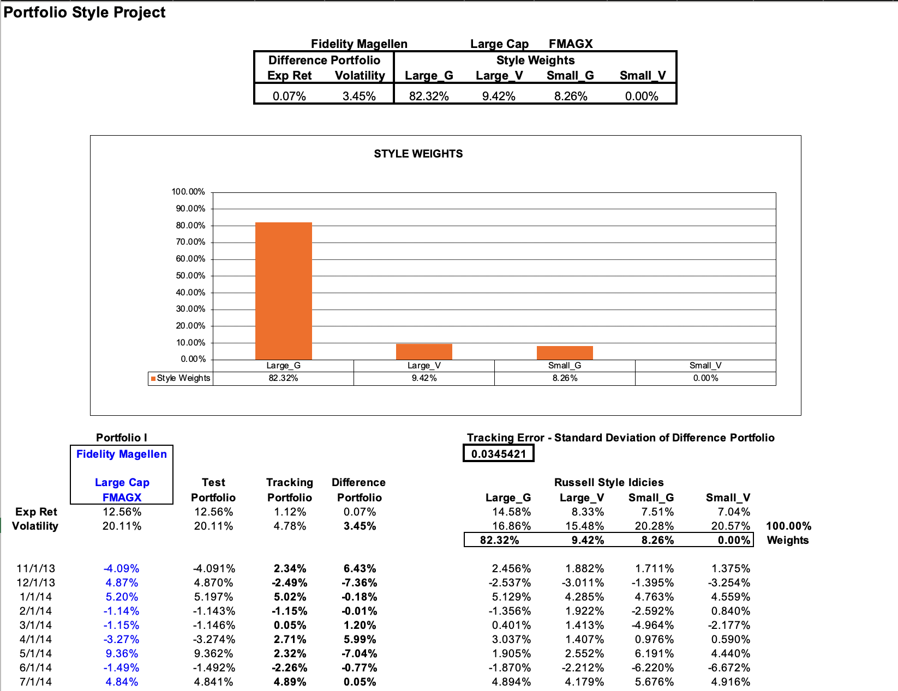

# Portfolio Style Analysis — Fidelity Magellan Fund

## Overview
What does a fund *really* own beneath the surface?

This project reverse-engineers the investment style of the **Fidelity Magellan Fund (FMAGX)** by comparing its return pattern against a blend of **Russell style indices**. Using return matching and optimization, I estimated the combination of style buckets that most closely replicated the fund’s behavior over time.

The result: a data-driven view of whether the fund behaved more like **Large Growth, Large Value, Small Growth, or Small Value**.

---

## Why This Project Matters
Portfolio labels can be misleading. A fund may be called “large cap,” but its actual return behavior can reveal a more specific style tilt.

This project answers:
- What style exposures best explain FMAGX returns?
- How closely can index-based style weights replicate the fund?
- What does the tracking error say about the quality of the fit?

---

## Objective
The goal was to estimate the **style composition** of Fidelity Magellan by:

- comparing fund returns with Russell style index returns
- using **Solver optimization** to minimize tracking error
- identifying the style weights that best replicate the fund
- evaluating the difference portfolio and residual volatility

---

## Data Used
The analysis uses:
- **Fidelity Magellan Fund (FMAGX)**
- **Russell 1000 Large Growth**
- **Russell 1000 Large Value**
- **Russell 2000 Small Growth**
- **Russell 2000 Small Value**
- **S&P 500**
- **Risk-free returns**

The workbook includes:
- adjusted prices
- annual and monthly returns
- style index returns
- risk-free rate comparisons
- optimized style weights
- tracking portfolio vs. actual fund returns

---

## Methodology
### Step 1 — Build the return set
I organized the fund and benchmark index data into a common return framework using monthly returns.

### Step 2 — Estimate style weights
Using **Excel Solver**, I optimized the weights of the Russell style indices so that the weighted index portfolio most closely matched FMAGX returns.

### Step 3 — Measure tracking error
I calculated the **difference portfolio** between actual fund returns and the synthetic style portfolio, then measured its standard deviation as tracking error.

### Step 4 — Interpret the style profile
The optimized weights revealed the dominant style exposure and whether the fund had meaningful secondary tilts.

---

## Key Result
The optimized style mix showed that **Fidelity Magellan behaved primarily like a Large Growth fund**, with smaller exposures to Large Value and Small Growth, and effectively no Small Value exposure.

### Final Style Weights
- **Large Growth:** 82.32%
- **Large Value:** 9.42%
- **Small Growth:** 8.26%
- **Small Value:** 0.00%

### Tracking Error
- **Difference Portfolio Volatility:** 3.45%

This suggests that the style replication was fairly strong, with most of the fund’s return behavior explained by a dominant large-cap growth tilt.

---

## Project Screenshots

### 1) Input Data and Benchmark Setup
This sheet contains the raw return inputs for FMAGX, the Russell style indices, the S&P 500, and risk-free returns.

---

### 2) Optimized Style Weights and Tracking Error
This sheet shows the Solver-based output, including the estimated style weights and the tracking error of the difference portfolio.

---

## Key Insights
- The fund had a **clear large-cap growth bias**
- Large Value and Small Growth played a secondary role
- Small Value had **no meaningful explanatory weight**
- A relatively low difference portfolio volatility suggests the style fit was directionally strong
- Return decomposition can provide a more useful view of portfolio behavior than a fund label alone

---

## Skills Demonstrated
- Portfolio analysis
- Style attribution
- Tracking error analysis
- Excel Solver optimization
- Return decomposition
- Investment analysis
- Data organization and benchmarking
- Financial modeling in Excel

---

## Tools Used
- Microsoft Excel
- Excel Solver
- Return-based style analysis
- Benchmark comparison framework

---

## Files Included
- Portfolio style input workbook
- Optimized output screenshots
- README documentation

---

## What I Learned
This project showed me how portfolio analysis goes beyond labels. By using return-based optimization, I was able to translate fund performance into a style fingerprint and better understand how benchmark exposures drive real-world outcomes.

---

## Next Step Ideas
A natural extension of this project would be:
- comparing multiple mutual funds
- running rolling style analysis over time
- testing how style exposures shift across market regimes
- expanding the model to sector and factor benchmarks
